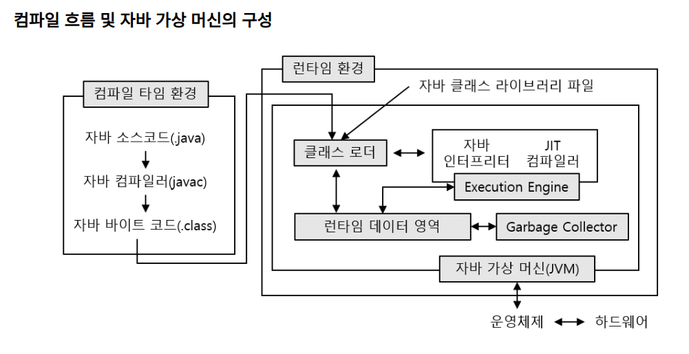
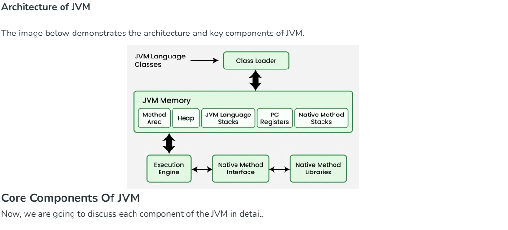
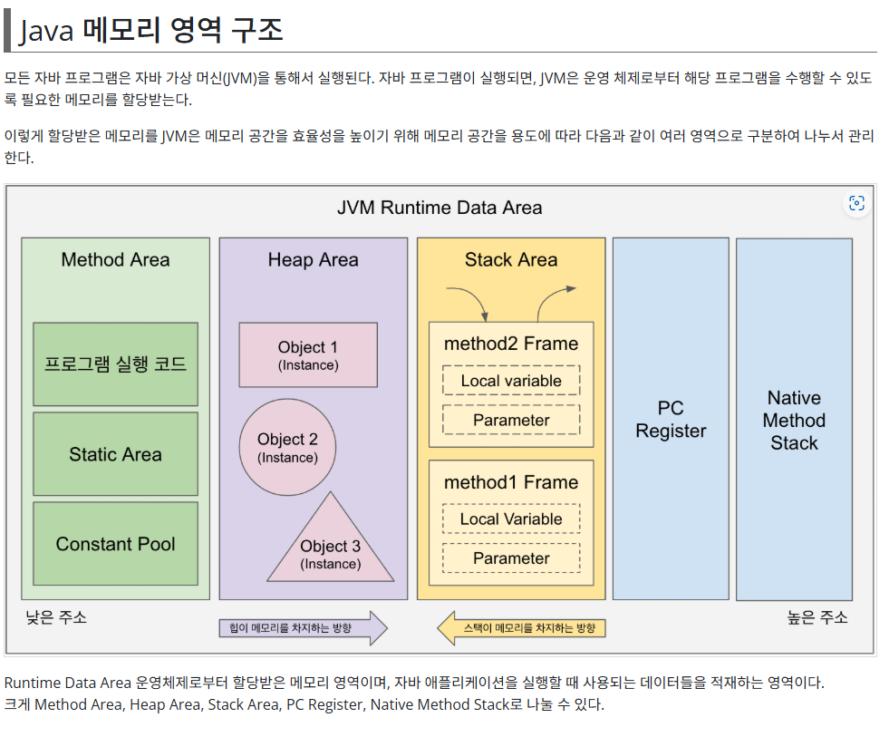

# 1. 자바 프로그래밍 구조
#### - 자바 프로그램은 class 단위로 생성된다.
#### - class명은 파일명과 동일하고, 반드시 첫글자는 대문자로 한다. 두 단어가 연결되는 경우에는 두번째 단어의 첫글자도 대문자로 한다.
####	예시) Hello.java, HelloWorld.java
#### - 프로그램 실행을 위해서는 반드시 main 메소드를 포함하여야 한다.
####	메인 메소드 구조 : public static void main(String[] args){실행 로직} - 수정가능한 부분은 args를 다른이름으로 바꾸는것 뿐
#### - 대소문자를 구분하여 프로그램을 작성한다.
#### - 주석처리는 //(한줄),/*~~*/(여러줄), /**~~*/(JAVA Doc 문서)을 사용한다. 주석 단축키 [CTRL + /]
#### - 실행로직은 {}(- 블록이라 부름) 블록단위로 구성된다.

# 2. 네이밍 규칙 - 클래스 명에 적용.
### (1) 파스칼 케이스(Pascal Case)
#### - 첫글자를 대문자로 작성하고, 연결되는 단어의 첫글자도 대문자로 작성한다.
#### - 예시) WELCOMETOHELLOJAVA - 파스칼 케이스로 변경 > WelcomeToHelloJava
#### - 자바의 클래스명 정의에 사용한다.

### (2) 카멜 케이스(Camel Case)
#### - 첫글자는 소문자로 작성하고, 연결되는 단어의 첫글자들은 대문자로 작성한다.
#### - 예시) WELCOMETOHELLOJAVA - 카멜 케이스로 변경 > welcomeToHelloJava
#### - 자바의 변수명, 상수명, 메소드 명 등 정의에 사용한다.

### (3) 케밥 케이스(Kebab Case)
#### - 단어들의 연결을 '-'(하이픈)으로 하고 전체 소문자로 작성한다.
#### - WELCOMETOHELLOJAVA - 케밥 케이스로 변경 > welcome-to-hello-java
#### - 자바에서 지원 안함

### (4) 스네이크 케이스(Snake Case)
#### - 단어들의 연결을 '_'(언더바)로 하고 전체 소문자로 작성한다.
#### - WELCOMETOHELLOJAVA - 스네이크 케이스로 변경 > welcome_to_hello_java
#### - 자바의 패키지, 프로젝트 정의에 사용한다.
#### - 데이터베이스의 데이터베이스명, view명, 테이블 명 등의 정의시 사용.
#### - Java 기본 라이브러리의 패키지의 경우 java.long이런 식으로 되는데 이것도 스네이크 중 한 종류다.

# 3. 자바 프로그램 실행 로직
### (0)프로그램 실행 환경
### 한국인 ------------- 미국인(한국어 가능) - 대화 가능
### 한국인(영어 불가능)---- 번역기나 통역 ---- 미국인(한국어 불가능) - 번역기나 통역을 통해 대화가 가능.

### 인간(개발언어 - 프로그래밍 언어, 영어, 숫자) -----컴파일러 또는 인터프리터가 번역------ 기계 또는 시스템(기계어 : 이진수 )

#### - 기계는 기계어(이진수)를 사용하고, 기계어는 이진수로 구성됨.
#### - 컴파일러(compiler): 프로그램 코드 전체를 읽어서 실행파일을 생성하는 형식 --> C, Fortran, Cobol,,,
#### - 인터프리터(interpreter) : 프로그램 코드 한줄씩 읽어서 바로 실행하는 형식. --> HTML, JavaScript,,,,
#### - 하이브리드(hybrid) : 컴파일러 + 인터프리터 --> JAVA

### (1)컴파일환경 : 컴파일 + 인터프리터 형태로 실행.

#### - Hello.java 실행 ----(컴파일 javac)----> Hello.class 생성 ----(인터프리터)----> JRE 환경에서 실행
####	(원시코드)									(바이트 코드)					(Java Runtime Environment)	
#### .class 파일은 프로젝트 폴더 > bin > 해당 이름의 패키지 폴더에 있다

---

#### 참고 주소 : https://8iggy.tistory.com/228

---

### (2) 자바 런타임 환경(JRE : Java Runtime Environment) 

#### 참고 주소 : https://medium.com/@delivalue100/%EC%99%9C-%EB%A7%8E%EC%9D%80-%EC%96%B8%EC%96%B4%EB%8A%94-%EB%9F%B0%ED%83%80%EC%9E%84%EC%97%90-%EA%B0%80%EC%83%81-%EB%9F%B0%ED%83%80%EC%9E%84-%ED%99%98%EA%B2%BD%EC%9D%84-%EC%9D%B4%EC%9A%A9%ED%95%A0%EA%B9%8C-a1db74213341

---

#### 참고 주소 : https://www.devkuma.com/docs/jvm/memory-structure/

